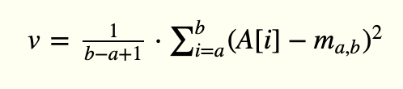
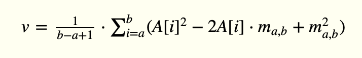
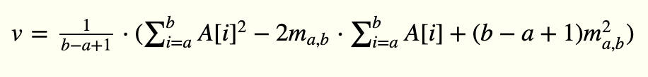
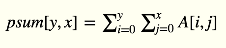
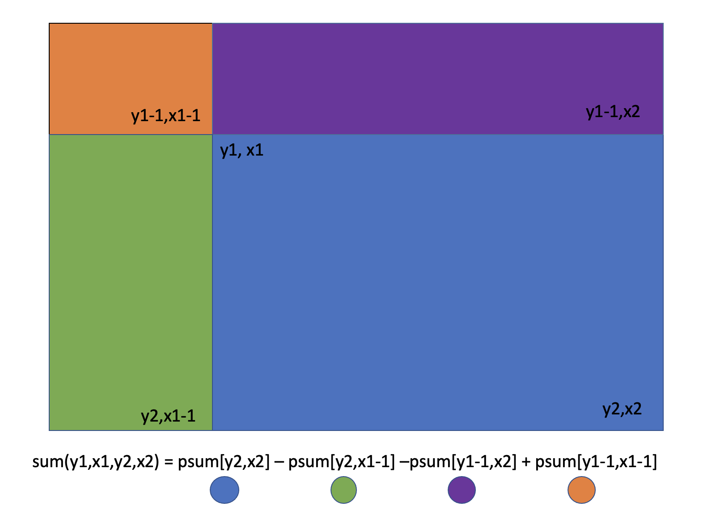
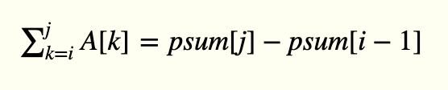

## 부분합 도입  

부분합이란 원소의 합을 구해둔 배열이다.  
누적합 배열 psum[]에 대하여 a부터 b까지의 합을 구하고 싶을 때: psum[b]-psum[a-1]  

#### 부분합 계산하기

```cpp
코드 17.1 부분합을 계산하는 함수와 이를 이용해 구간합을 계산하는 함수

// 주어진 벡터 a의 부분합을 계산한다.
vector<int> partialSum(const vector<int> &a){
    vector<int> ret(a.size());
    ret[0] = a[0];
    for(int i=1; i<= a.size(); i++)
        ret[i] = ret[i-1] + a[i];
    return ret;
}

// 어떤 벡터의 부분합 psum[]이 주어질 때, 원래 벡터의 a부터 b까지의 합을 구한다.
int rangeSum(const vector<int>& psum, int a, int b){
    if(a == 0) return psum[b];
    return psum[b] - psum[a-1];
}
```

#### 부분 합으로 분산 계산하기

부분 합 psum을 계산해 두면 원 벡터의 구간 합을 구하기가 쉽다.  
코드 17.1의 rangeSum()은 특정 구간의 합을 O(1)로 계산해준다. 따라서 rangeSum()의 결과를 b-a+1로 나누면 해당 구간의 평균을 쉽게 구할 수 있다.  

부분 합을 잘 이용하면 합 혹은 평균 외에도 다른 값들을 쉽게 계산할 수 있다. 한 가지 예로 특정 구간의 분산(variance)가 있다. 배열 A[]의 구간 A[a..b]의 분산은 다음과 같은 식으로 정의된다.  
  
이 식에서 m(a,b)는 해당 구간의 평균이다. psum을 이용해 m(a,b)는 금방 계산할 수 있다고 해도, 이것만으로는 분산을 계산하기 힘들다. 그러나 이식을 다음과 같이 정리할 수 있다. 
  
  
  
이 때 괄호 안의 세 항 중, 가운데 항과 오른쪽 항은 psum을 이용해 쉽게 계산 할 수 있다. 문제가 되는 게 A[i]^2의 합인 왼쪽 항인데, 이것 또한 A[]의 각 원소의 제곱의 부분 합을 저장하는 배열을 미리 만들어두면 O(1)에 계산할 수 있다. 코드17.2는 이 방법의 구현을 보여준다. 8.4의 Quantization을 풀 때도 이런 방법을 사용했다.  
```cpp
코드 17.2 배열의 부분합과 제곱의 부분합을 입력받고 특정 구간의 분산을 계샇ㄴ하는 함수의 구현

// A[]의 제곱의 부분 합 벡터 sqpsum, A[]의 부분 합 벡터 psum이 주어질 때
// A[a..b]의 분산을 반환한다.
double variance(const vector<int<& sqpsum, const vector<int>& psum, int a, int b){
    // 우선 해당 구간의 평균을 계산한다.
    double mean = rangeSum(psum, a, b) / double(b-a+1);
    double ret = rangeSum(sqpsum, a, b) -2 * mean * rangeSum(psum, a, b) + (b - a +1) * mean * mean;
    retrun ret / (b - a +1);
}
```
#### 2차원으로의 확장  
A[y1,x1]에서 A[y2,x2]까지의 직사각형 구간의 합을 계산행한다고 하자.  
  
위와 같은 부분 합 배열을 사용해 구간합을 빠르게 구할 수 있다.  

  

```cpp
코드 17.3 부분 합을 이용해 2차원 배열의 구간 합을 구하는 함수

// 어떤 2차원 배열 A[][]의 부분합 psum[][]이 주어질 때,
// A[y1,x1]과 A[y2,x2]를 양 끝으로 갖는 부분 배열의 합을 반환한다.
int gridSum(const vector<vector<int>>&psum , int y1, int x1, int y2, int x2){
    int ret = psum[y2][x2];
    if(y >0 ) ret -= psum[y-1-1][x2];
    if(x1 > 0) ret -= psum[y2][x1-1];
    if(y1 >0 && x1 >0) ret += psum[y1-1][x1-1];
    return ret;
}
```

#### 예제: 합이 0에 가장 가까운 구간


A[10] = {-14,7,2,3,-8,4,-6,8,9,11}
인 배열 A[]가 있다고 하자. A[]에는 합이 0인 구간은 없지만, 0에 가장 가까운 구간은 A[2]~A[5]로 1이다. 완전탐색을 하려면 O(n^2)의 시간이 걸린다.  


구간합을 사용하면 A[i] ~ A[j] 구간의 합을 다음과 같이 표현할 수 있다.  

  

이 값이 0에 가깝다는 말은 psum[]의 두 값의 차이가 가장 적다는 뜻이다. 주어진 배열에서 가장 가까운 두 값을 찾으려면 배열을 정렬하고 인접한 원소를 확인하면 된다. 정렬시간 O(NlgN)과 부분합과 인접한 원소들을 확인하는 시간 O(N)으로 이 알고리즘의 수행시간은 O(NLgN)이 된다.  
